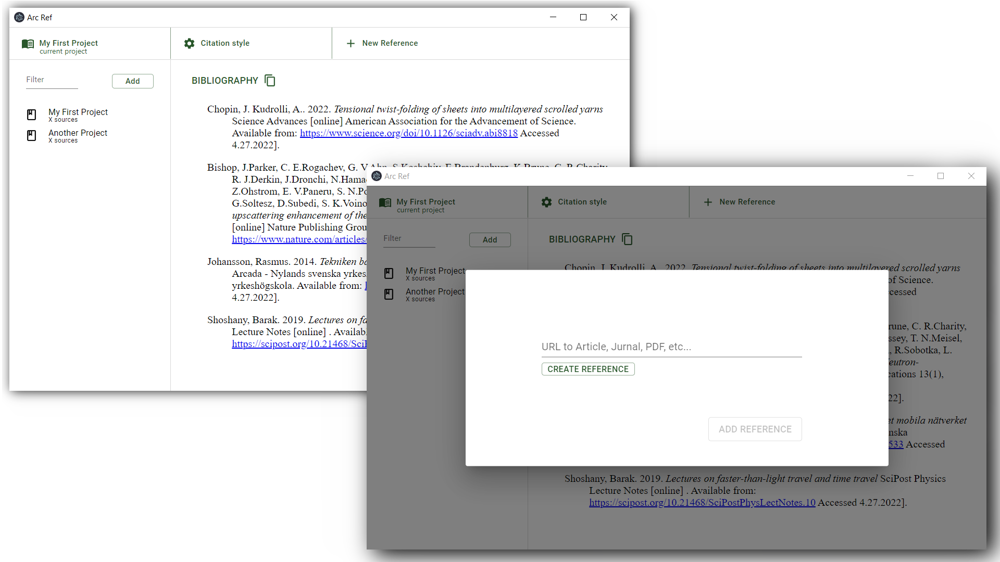

# Arc Ref
`NOTE: this project is still under development`

A small reference and citation software built with electron, bootstrapped with create-react-app and material UI. With the goal of providing an intuitive simple user interface with only the features you absolutely need.

This program is intended as an aid for school projects and short articles. 
The simple user interface lets you copy URLs from the internet as you go and just focus on your writing. Not thinking about how to reference and what information you need from the site. 

The program does not rely on any database but tries to figure out all the information by scraping the website you insert. It does not store your citations in some cloud service, it is all there on your computer. 

The program features rich text copy-and-paste to put your citations in any text editor without any extra plugins.

This program is not for large-scale projects where you also need to manage text passages and want to use the system to manage your thoughts. For this use case, a program like Mendeley, RefWorks, or Zotero would be a better choice.  

## UI version 1

## Developers 

`npm install` to install dependencies

`npm dev` to start the development environment 

### Notes 

redux stores the state of the entire app and occasionally writes it to file.
`types_of_work.js` is where all formatting takes place related to different types of work.
the backend handles the formatting of individual items to allow the user to correct them afterward. 

